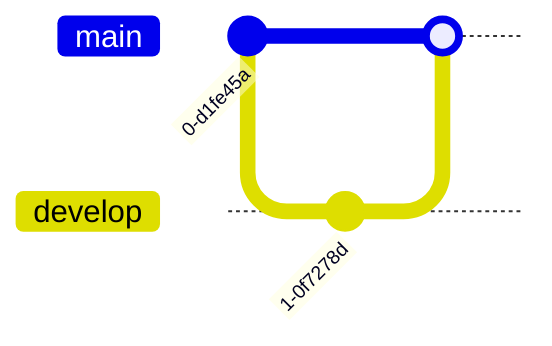

# 🎉 Bienvenidos a Nuestro Proyecto de Kotlin

## 📑 Tabla de Contenidos
- [🎉 Bienvenidos a Nuestro Proyecto de Kotlin](#-bienvenidos-a-nuestro-proyecto-de-kotlin)
  - [📑 Tabla de Contenidos](#-tabla-de-contenidos)
  - [👥 Sobre nosotros](#-sobre-nosotros)
  - [📊 Datos del Proyecto](#-datos-del-proyecto)
  - [🔗 Enlaces](#-enlaces)
    - [📹 Videos de Ejercicios](#-videos-de-ejercicios)
  - [📝 Código de Ejemplo](#-código-de-ejemplo)
  - [📋 Listas](#-listas)
    - [Lista Ordenada](#lista-ordenada)
    - [Lista Desordenada](#lista-desordenada)
  - [📧 Contacto](#-contacto)
  - [📊 Gráficos](#-gráficos)
    - [Gráfica Circular](#gráfica-circular)
  - [📊 Tablas](#-tablas)
  - [🎨 Texto de Colores](#-texto-de-colores)
  - [📜 Formato de Textos](#-formato-de-textos)
  - [📊 Diagramas](#-diagramas)
    - [Diagrama de Flujo](#diagrama-de-flujo)
    - [Diagrama de Secuencia](#diagrama-de-secuencia)
    - [Diagrama Entidad-Relación](#diagrama-entidad-relación)
    - [Diagrama Journey](#diagrama-journey)
    - [Diagrama de Git](#diagrama-de-git)
    - [Diagrama de Gantt](#diagrama-de-gantt)
    - [Diagrama de Requerimientos](#diagrama-de-requerimientos)

## 👥 Sobre nosotros 
[🔝 Volver a la Tabla de Contenidos](#-tabla-de-contenidos)

<p align="justify">
En este proyecto, buscamos proporcionar una solución innovadora para la gestión de un gimnasio utilizando Kotlin. Nuestro objetivo es ayudar a las personas a realizar deporte de manera eficiente y organizada.
</p>

<p align="justify">
Nuestra aplicación móvil para el gimnasio está diseñada para mejorar la experiencia de nuestros miembros, permitiéndoles gestionar sus rutinas de entrenamiento y seguimiento de progreso de manera eficiente. Con la aplicación, los usuarios pueden:
</p>

- **📅 Reservar clases**: Planificar y reservar clases fácilmente.
- **📹 Acceder a tutoriales**: Ver videos y tutoriales de ejercicios.
- **📊 Monitorear progreso**: Llevar un registro detallado de sus entrenamientos.
- **🔔 Recibir notificaciones**: Obtener recordatorios y alertas personalizadas.

## 📊 Datos del Proyecto
[🔝 Volver a la Tabla de Contenidos](#-tabla-de-contenidos)

<p align="center">


</p>

## 🔗 Enlaces

[🔝 Volver a la Tabla de Contenidos](#-tabla-de-contenidos)

### 📹 Videos de Ejercicios
<p align="center">
        <a href="https://www.youtube.com/watch?v=vgcvNY5BA7w">
                
        </a>
        <br>
        <strong>Curso de Kotlin</strong>
</p>

## 📝 Código de Ejemplo
[🔝 Volver a la Tabla de Contenidos](#-tabla-de-contenidos)

```kotlin
fun saludar(nombre: String) {
        println("Hola, $nombre!")
}

saludar("Mundo")
```

## 📋 Listas
[🔝 Volver a la Tabla de Contenidos](#-tabla-de-contenidos)

### Lista Ordenada
1. Primer elemento
2. Segundo elemento
3. Tercer elemento

### Lista Desordenada
- Elemento 1
- Elemento 2
- Elemento 3

## 📧 Contacto
[🔝 Volver a la Tabla de Contenidos](#-tabla-de-contenidos)

Para más información, puedes contactarnos a través de correo electrónico.

## 📊 Gráficos
[🔝 Volver a la Tabla de Contenidos](#-tabla-de-contenidos)

### Gráfica Circular


## 📊 Tablas
[🔝 Volver a la Tabla de Contenidos](#-tabla-de-contenidos)

| Nombre          | Descripción                        | Precio |
|-----------------|------------------------------------|--------|
| Clase de Yoga   | Clase relajante de yoga            | $20    |
| Clase de Spinning | Clase intensiva de spinning       | $25    |
| Clase de Pilates | Clase de pilates para fortalecimiento | $30    |

## 🎨 Texto de Colores
[🔝 Volver a la Tabla de Contenidos](#-tabla-de-contenidos)

<p style="color:red;">Este texto es de color rojo.</p> <p style="color:blue;">Este texto es de color azul.</p> <p style="color:green;">Este texto es de color verde.</p>

## 📜 Formato de Textos
[🔝 Volver a la Tabla de Contenidos](#-tabla-de-contenidos)

**Negrita**: **Texto en negrita**

*Cursiva*: *Texto en cursiva*

~~Tachado~~: ~~Texto tachado~~

Código en línea: `Código en línea`

## 📊 Diagramas
[🔝 Volver a la Tabla de Contenidos](#-tabla-de-contenidos)

### Diagrama de Flujo
[🔝 Volver a la Tabla de Contenidos](#-tabla-de-contenidos)



```mermaid
flowchart TD
        A[Inicio] --> B{¿Es miembro?}
        B -->|Sí| C[Acceso a la aplicación]
        B -->|No| D[Registro]
        C --> E[Reservar clase]
        D --> E
```

### Diagrama de Secuencia
[🔝 Volver a la Tabla de Contenidos](#-tabla-de-contenidos)



```mermaid
sequenceDiagram
        participant Usuario
        participant Aplicación
        Usuario->>Aplicación: Solicita reservar clase
        Aplicación->>Usuario: Confirma reserva
```

### Diagrama Entidad-Relación
[🔝 Volver a la Tabla de Contenidos](#-tabla-de-contenidos)


### Diagrama Journey
[🔝 Volver a la Tabla de Contenidos](#-tabla-de-contenidos)



```mermaid
journey
        title Experiencia del Usuario
        section Registro
                Usuario: 5: Registro
                Aplicación: 3: Confirmación
        section Reserva
                Usuario: 4: Reserva de clase
                Aplicación: 2: Confirmación de reserva
```

### Diagrama de Git
[🔝 Volver a la Tabla de Contenidos](#-tabla-de-contenidos)



### Diagrama de Gantt
[🔝 Volver a la Tabla de Contenidos](#-tabla-de-contenidos)



```mermaid
gantt
        title Planificación del Proyecto
        dateFormat  YYYY-MM-DD
        section Desarrollo
        Diseño de la aplicación :done, des1, 2023-10-01, 2023-10-10
        Implementación :active, des2, 2023-10-11, 2023-10-20
        Pruebas : des3, 2023-10-21, 2023-10-30
```

### Diagrama de Requerimientos
[🔝 Volver a la Tabla de Contenidos](#-tabla-de-contenidos)


